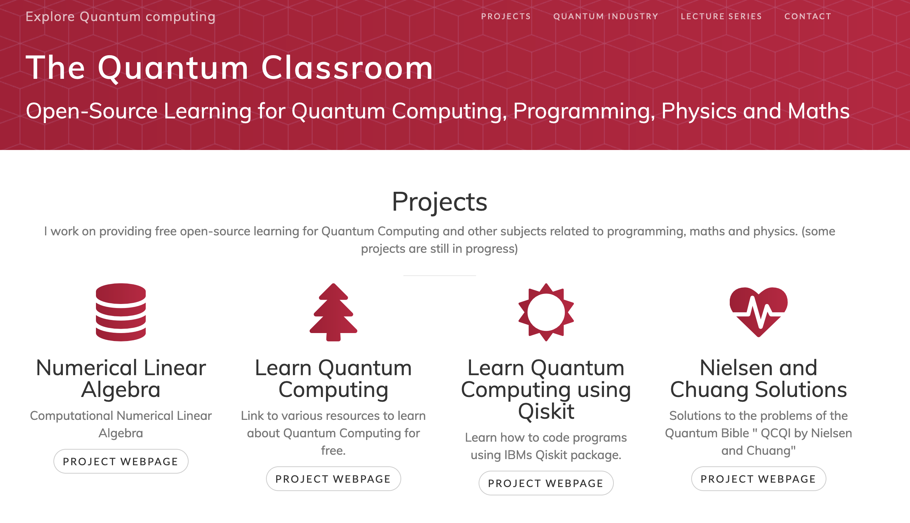

# Portfolio

## Table of Contents
- [Research Interests](#research-interests)
- [Education](#education)
- [Work Experience](#work-experience)
- [Research Projects](#research-projects)
  - [A Comparative Study of Quantum Optimization Techniques for Solving Combinatorial Optimization Benchmark Problems](#a-comparative-study-of-quantum-optimization-techniques-for-solving-combinatorial-optimization-benchmark-problems)
  - [Quantum Monte Carlo Methods for Newsvendor Problem with Multiple Unreliable Suppliers](#quantum-monte-carlo-methods-for-newsvendor-problem-with-multiple-unreliable-suppliers)
  - [Quantum Enhanced Simulation-Based Optimization for Newsvendor Problems](#quantum-enhanced-simulation-based-optimization-for-newsvendor-problems)
  - [Quantum Relaxation for Solving Multiple Knapsack Problems](#quantum-relaxation-for-solving-multiple-knapsack-problems)
- [Quantum Education Work](#quantum-education-work)
  - [Quantum Classroom Website](#quantum-classroom-website)
  - [Medium Blogs](#medium-blogs)
- [Publications](#publications)
- [Media Coverage](#media-coverage)

---

## Research Interests

**Quantum Physics, Quantum Computation, Quantum Optimization, and Algorithms**

---

## Education

| Degree | Field                    | Institution                                               | Date      |
| ------ | ------------------------ | --------------------------------------------------------- | --------- |
| M.S.   | Physics and Data Science | Indian Institute of Science Education and Research Mohali | June 2022 |
| B.S.   | Physics and Data Science | Indian Institute of Science Education and Research Mohali | June 2020 |

---

## Work Experience

**Research Engineer @ School of Computing and Information Systems, Singapore Management University**  
*January 2023 – Present*

- [A Comparative Study of Quantum Optimization Techniques for Solving Combinatorial Optimization Benchmark Problems](#a-comparative-study-of-quantum-optimization-techniques-for-solving-combinatorial-optimization-benchmark-problems)
- [Quantum Monte Carlo Methods for Newsvendor Problem with Multiple Unreliable Suppliers](#quantum-monte-carlo-methods-for-newsvendor-problem-with-multiple-unreliable-suppliers)
- [Quantum Enhanced Simulation-Based Optimization for Newsvendor Problems](#quantum-enhanced-simulation-based-optimization-for-newsvendor-problems)
- [Quantum Relaxation for Solving Multiple Knapsack Problems](#quantum-relaxation-for-solving-multiple-knapsack-problems)

---

## Research Projects

### A Comparative Study of Quantum Optimization Techniques for Solving Combinatorial Optimization Benchmark Problems
**Publication:** [arXiv:2503.12121](https://arxiv.org/abs/2503.12121)

- **Overview:** Quantum optimization holds promise for addressing classically intractable combinatorial problems, yet a standardized benchmarking framework is still lacking.
- **Framework:** Introduces a comprehensive approach to evaluate quantum optimization techniques against NP-hard problems such as the Multi-Dimensional Knapsack Problem (MDKP), Maximum Independent Set (MIS), Quadratic Assignment Problem (QAP), and Market Share Problem (MSP).
- **Techniques:** Benchmarks gate-based approaches like the Variational Quantum Eigensolver (VQE) and its CVaR variant, alongside advanced methods such as the Quantum Approximate Optimization Algorithm (QAOA) and its extensions.
- **Additional Methods:** Incorporates qubit compression techniques like Pauli Correlation Encoding (PCE) and Quantum Random Access Optimization (QRAO).
- **Results:** Provides insights into feasibility, optimality gaps, and scalability based on experiments with simulated quantum environments and classical solvers.

---

### Quantum Monte Carlo Methods for Newsvendor Problem with Multiple Unreliable Suppliers
**Publication:** [arXiv:2409.07183](https://arxiv.org/abs/2409.07183)

- **Overview:** Addresses the challenges in inventory management amid increased supply chain uncertainties in a post-pandemic world.
- **Focus:** Integrates decision-makers' risk preferences into the classic newsvendor model.
- **Technique:** Utilizes Quantum Monte Carlo (QMC) combined with Quantum Amplitude Estimation (QAE) for efficient probability and expectation value estimation—offering a near-quadratic speedup over classical methods.
- **Impact:** Illuminates the link between risk-aware decision-making and inventory management, contributing to enhanced supply chain resilience.

---

### Quantum Enhanced Simulation-Based Optimization for Newsvendor Problems
**Publication:** [IEEE Xplore](https://ieeexplore.ieee.org/document/10821393)

- **Overview:** Utilizes a maximum profit formulation for the Newsvendor Problem to broaden its applicability beyond traditional minimal loss approaches.
- **Innovation:** Employs Quantum Generative Adversarial Networks (qGANs) to model unknown demand distributions, creating more realistic scenarios.
- **Improvement:** Introduces a new comparison operator that reduces the number of qubits required in the simulation circuit.

---

### Quantum Relaxation for Solving Multiple Knapsack Problems
**Publication:** [IEEE Xplore](https://ieeexplore.ieee.org/document/10821401)

- **Overview:** Investigates the effectiveness of Quantum Random Access Optimization (QRAO) in tackling complex constrained supply chain issues.
- **Application:** Demonstrates the solution of a Multiple Knapsack Problem (MKP) using QRAO combined with classical methods like Linear Relaxation (LR) on a real-world risk-aware procurement optimization problem involving over 100 variables.
- **Insight:** Highlights the potential of integrating quantum relaxation techniques with traditional optimization methods to enhance problem-solving capabilities.

---

## Quantum Education Work

### Quantum Classroom Website
**Learning Material**

A website offering free resources to learn quantum computing, featuring both original content and contributions from the quantum computing community.  
[Visit Website](https://monitsharma.github.io)  

---

### Medium Blogs
**Educational Outreach**

Regular blogs covering recent quantum computing papers, coding tutorials, and practical exercises.  
[View Blogs](https://medium.com/@_monitsharma)  

---

## Publications

- **M. Sharma and H. C. Lau**  
  *A Comparative Study of Quantum Optimization Techniques for Solving Combinatorial Optimization Benchmark Problems*  
  arXiv preprint, [arXiv:2503.12121](https://arxiv.org/abs/2503.12121) (2025)

- **M. Sharma and H. C. Lau**  
  *Quantum Monte Carlo Methods for Newsvendor Problem with Multiple Unreliable Suppliers*  
  arXiv preprint, [arXiv:2409.07183](https://arxiv.org/abs/2409.07183) (2024)

- **M. Sharma, Y. Jin, H. C. Lau, and R. Raymond**  
  *Quantum Relaxation for Solving Multiple Knapsack Problems*  
  Proceedings of the 2024 IEEE International Conference on Quantum Computing and Engineering (QCE), Montreal, QC, Canada, pp. 692–698.  
  [DOI: 10.1109/QCE60285.2024.00086](https://doi.org/10.1109/QCE60285.2024.00086)

- **M. Sharma, H. C. Lau, and R. Raymond**  
  *Quantum Enhanced Simulation-Based Optimization for Newsvendor Problems*  
  Proceedings of the 2024 IEEE International Conference on Quantum Computing and Engineering (QCE), Montreal, QC, Canada, pp. 457–468.  
  [DOI: 10.1109/QCE60285.2024.00060](https://doi.org/10.1109/QCE60285.2024.00060)

---

## Media Coverage

- **Celebrating Excellence: SMU Honours Four Research Staff Supporting Key Research**  
  [Read Article](https://news.smu.edu.sg/news/2024/11/29/celebrating-excellence-smu-honours-four-research-staff-supporting-key-research)

- **Quantum Computing: Marathon Not a Sprint**  
  [Read Article](https://research.smu.edu.sg/news/2025/feb/quantum-computing-marathon-not-sprint)
