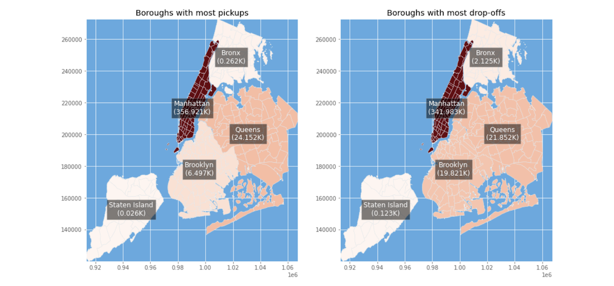
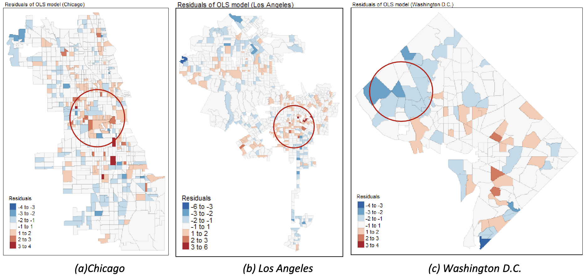

## Research Interests

#### Quantum Physics, Quantum Computation, Quantum Optimization and Algorithms

## Education							       		
- M.S.  Physics and Data Science	| Indian Institute of Science Education and Research Mohali (_June 2022_)	 			        		

- B.S.  Physics                     | Indian Institute of Science Education and Research Mohali (_June 2020_)

## Work experience 
**Research Engineer @ School of Computing and Information Systems, Singapore Management University (_January 2023 - present_)**
- [QSBO for NP-hard Newsvendor](#qsbo)
- [Quantum Relaxation for Multiple Knapsack](#qrao)

**Researcher @ Tata Consultancy Services (_October 2021 - June 2022_)**  
- [Mining real estate ads and property transactions for building and amenity data acquisition](#real_estate)
  
---

## Work

### Quantum Enhanced Simulation Based Optimization for Newsvendor Problems

[Publication](https://arxiv.org/abs/2403.17389)  

- We utilize the maximum profit formulation for the Newsvendor Problem, which has broader applicability compared to the minimal loss formulation commonly found in the literature.
- Our approach involves an unknown demand distribution, where a function may not precisely capture the demand in such settings, to address this, we employ Quantum Generative Adversarial Networks (qGANs) to load the unknown demand distribution, thereby creating a more realistic scenario.
- We improve the simulation-based optimization method in by introducing a new comparison operator, thereby reducing the number of qubits needed in the circuit.

### Quantum Relaxation for Solving Multiple Knapsack Problems

[Publication](https://arxiv.org/abs/2404.19474)

- Explored the effectiveness of QRAO in addressing the inherent complexities of constrained supply chain problems, by solving a Multiple Knapsack Problem (MKP) and comparing it with the well-studied QAOA approach.
- Scaled up a real-world multiple knapsack-based Risk-Aware Procurement Optimization problem involving ≥ 100 variables and demonstrating the prospect of combining QRAO with a classical method in operations research, namely Linear Relaxation (LR)

### Mining Real Estate Ads and Property Transactions for Building and Amenity Data Acquisition
##### Urban Science, GIS
[Publication](https://link.springer.com/article/10.1007/s44212-022-00012-2)

- Developed an entirely new mechanism to maintain spatial databases by detecting unmapped buildings and amenities and adding unfilled building attributes detected from real estate data
- Extracted locations and attributes of buildings and amenities from 295,880 real estate listings and 954,510 transaction records by using Python and R 
- The mechanism can achieve accuracy rates of over 90% in identifying locations of unmapped amenities and adding unfilled building attributes

---

## Data engineering work

### Gojek taxi data processing
##### Language: Python

Developed codes to aggregate over a million records of order-level taxi data into trip-level taxi data. For more details, please [View codes](https://github.com/chenxy285/gojek_taxi/tree/main).

---

## Other coursework projects

### Spatial-temporal Analysis of Taxi Demand in New York City
##### Urban Science, spatio-temporal analytics, transportation
[View project report, codes, and data](https://github.com/chenxy285/taxi_demand_analysis_NYC) 
 

### Exploring Influencing Factors of Airbnb Penetration in Three U.S. Cities Using Spatial Regression Analysis
##### Urban Science, spatial analytics, real estate
[View project report and data](https://github.com/chenxy285/Airbnb_study) 
 

---

### Publications
- Yan Jin, Monit Sharma, Hoong Chuin Lau and Rudy Raymond. Quantum Relaxation for Solving Multiple Knapsack Problems. e-Print: 2404.19474 [quant-ph]

- Monit Sharma, Hoong Chuin Lau and Rudy Raymond. Quantum-Enhanced Simulation-Based Optimization for Newsvendor Problems, 
e-Print: 2403.17389 [quant-ph] **[QIP2024 Taiwan Poster presented]**

 

  

