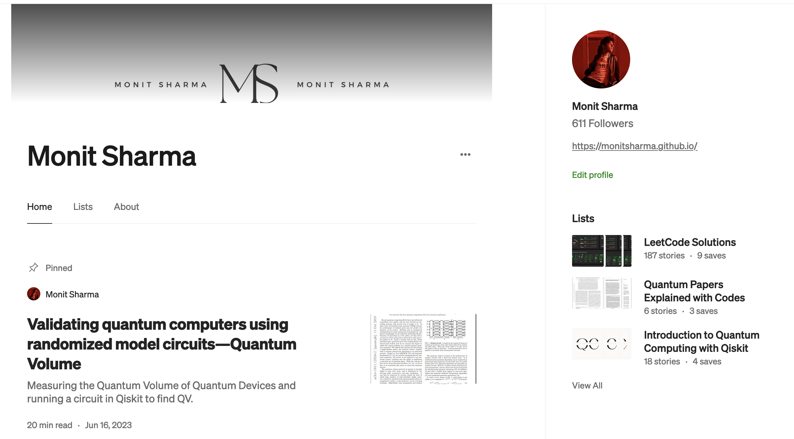

# Monit Sharma

  

    
Research Engineer · Singapore Management University

    <h1 class="hero-title">Quantum Computing, AI & Accelerated Optimisation</h1>
    
Quantum algorithms and machine learning, hybrid quantum-classical optimisation, and large-scale GPU/TPU/parallel programming for multi-domain research initiatives.

    

      <a class="cta-button primary" href="mailto:monitsharma437@gmail.com">Email Me</a>
      <a class="cta-button" href="https://www.linkedin.com/in/monitsharma/">Connect on LinkedIn</a>
      <a class="cta-button download" href="https://drive.google.com/file/d/1cpMer_X2pj9qonArw_F7TnuyVJUzpoVf/view?usp=sharing" target="_blank" rel="noopener">Download CV</a>
      <a class="cta-button" href="https://monitsharma.github.io/">Explore Quantum Classroom</a>
    

  

  <a class="quick-link-card" href="#expertise">
    🧠
    

      <h3>Expertise</h3>
      
Quantum systems, AI, accelerated computing.

    

  </a>
  <a class="quick-link-card" href="#experience">
    🛠️
    

      <h3>Experience</h3>
      
Industry-scale optimisation and R&D leadership.

    

  </a>
  <a class="quick-link-card" href="#research-publications">
    📄
    

      <h3>Research Publications</h3>
      
Peer-reviewed work on hybrid quantum methods.

    

  </a>
  <a class="quick-link-card" href="#open-source--teaching">
    🎓
    

      <h3>Open-Source & Teaching</h3>
      
Curricula, toolkits, and community outreach.

    

  </a>

## Table of Contents
- [Expertise](#expertise)
- [Experience](#experience)
- [Research Publications](#research-publications)
  - [Learning-Based Graph Shrinking for Quantum Optimization of Constrained Combinatorial Problems](#learning-based-graph-shrinking-for-quantum-optimization-of-constrained-combinatorial-problems)
  - [Transferable Equivariant Quantum Circuits for TSP: Generalization Bounds and Empirical Validation](#transferable-equivariant-quantum-circuits-for-tsp-generalization-bounds-and-empirical-validation)
  - [Hybrid Learning and Optimization methods for solving Capacitated Vehicle Routing Problem](#hybrid-learning-and-optimization-methods-for-solving-capacitated-vehicle-routing-problem)
  - [Cutting Slack Quantum Optimization with Slack Free Methods for Combinatorial Benchmarks](#cutting-slack-quantum-optimizaton-with-slack-free-methods-for-combinatorial-benchmarks)
  - [Adaptive Graph Shrinking for Quantum Optimization of Constrained Combinatorial Problems](#adaptive-graph-shrinking-for-quantum-optimization-of-constrained-combinatorial-problems)
  - [A Comparative Study of Quantum Optimization Techniques for Solving Combinatorial Optimization Benchmark Problems](#a-comparative-study-of-quantum-optimization-techniques-for-solving-combinatorial-optimization-benchmark-problems)
  - [Quantum Monte Carlo Methods for Newsvendor Problem with Multiple Unreliable Suppliers](#quantum-monte-carlo-methods-for-newsvendor-problem-with-multiple-unreliable-suppliers)
  - [Quantum Enhanced Simulation-Based Optimization for Newsvendor Problems](#quantum-enhanced-simulation-based-optimization-for-newsvendor-problems)
  - [Quantum Relaxation for Solving Multiple Knapsack Problems](#quantum-relaxation-for-solving-multiple-knapsack-problems)
- [Education](#education)
- [Open-Source & Teaching](#open-source--teaching)
  - [Quantum Classroom Platform](#quantum-classroom-platform)
  - [Medium Articles & Research Explainability](#medium-articles--research-explainability)
  - [Curated Learning Paths & Toolkits](#curated-learning-paths--toolkits)
- [Media Coverage](#media-coverage)

<section class="highlights" id="expertise">
  <article class="highlight-card">
    <h2>Quantum Optimisation Systems</h2>
    <ul class="experience-highlights">
      <li>Constraint-preserving mappings for routing and allocation on annealing and gate-based hardware.</li>
      <li>Variational circuit co-design with classical solvers to balance noise and solution quality.</li>
      <li>Hardware-in-the-loop validation emphasising robustness, interpretability, and resource-aware benchmarking.</li>
    </ul>
  </article>
  <article class="highlight-card">
    <h2>AI &amp; Reinforcement Learning</h2>
    <ul class="experience-highlights">
      <li>Reinforcement and imitation learning policies that adaptively steer hybrid optimisation pipelines.</li>
      <li>Generative and sequence models for demand profiling, scenario generation, and fast approximations.</li>
      <li>LLM-driven knowledge distillation to translate research insights into operational guidance.</li>
    </ul>
  </article>
  <article class="highlight-card">
    <h2>Accelerated Computing &amp; Infrastructure</h2>
    <ul class="experience-highlights">
      <li>GPU/TPU kernel optimisation for tensor networks, simulation, and large-batch training.</li>
      <li>Reproducible HPC workflows across clusters and cloud accelerators with automated telemetry.</li>
      <li>Production-grade engineering: containerised deployments, CI, and rigorous validation pipelines.</li>
    </ul>
  </article>
</section>

Experience

  <article class="experience-entry">
    

      

        <h3 class="experience-role">Research Engineer</h3>
        Jan 2023 – Present
      

      

        
School of Computing &amp; Information Systems, Singapore Management University

        Singapore
      

    

    <ul class="experience-highlights">
      <li>Leads hybrid optimisation programmes spanning capacitated routing, multi-knapsack planning, and stochastic inventory control across quantum, classical, and reinforcement learning paradigms.</li>
      <li>Builds benchmarking infrastructure comparing variational quantum algorithms, tensor-network relaxations, and classical heuristics on enterprise-scale workloads.</li>
      <li>Designs curriculum and outreach for the Quantum Classroom initiative through workshops, technical blogs, and open-source tooling.</li>
    </ul>
  </article>
  <article class="experience-entry">
    

      

        <h3 class="experience-role">Research &amp; Development Engineer</h3>
        2022
      

      

        
TATA Consultancy Services

        Mumbai, India
      

    

    <ul class="experience-highlights">
      <li>Deployed quantum annealing workflows on D-Wave hardware to solve vehicle routing across 200 customers and 25 vehicles, reducing cost and latency.</li>
      <li>Developed qubit-efficient mappings for mixed-integer supply-chain models, enabling quantum formulations within current hardware budgets.</li>
    </ul>
  </article>
  <article class="experience-entry">
    

      

        <h3 class="experience-role">M.S. Thesis Researcher</h3>
        2021 – 2022
      

      

        
Indian Institute of Science Education and Research Mohali

        Mohali, India
      

    

    <ul class="experience-highlights">
      <li>Collaborated with <a href="https://scholar.google.com/citations?user=od_3VI8AAAAJ&hl=en">Dr. Satyajit Jena</a> to investigate intersections between high-energy physics simulations and near-term quantum computing.</li>
      <li>Demonstrated that data re-uploading strategies achieve higher accuracy with single-qubit architectures than legacy approaches requiring larger qubit registers.</li>
    </ul>
  </article>

Research Publications

  <article class="timeline-item">
    
2025

    

      <h3 id="learning-based-graph-shrinking-for-quantum-optimization-of-constrained-combinatorial-problems">Learning-Based Graph Shrinking for Quantum Optimization of Constrained Combinatorial Problems</h3>
      
Learning-guided compression for hybrid solvers · arXiv:2510.14533

      <ul>
        <li>Introduced a learning-based graph shrinking technique to reduce instance size while preserving solution structure.</li>
        <li>Achieved substantial qubit reductions on benchmark combinatorial instances with minimal loss in optimisation quality.</li>
        <li>Accepted to the <em>AAAI 2026 Workshop on Quantum Computing (QC)</em>, to appear in <em>Communications in Computer and Information Science (CCIS)</em>, Springer Nature.</li>
      </ul>
      
<a href="https://arxiv.org/abs/2510.14533">Publication</a>

    

  </article>
  <article class="timeline-item">
    
2025

    

      <h3 id="transferable-equivariant-quantum-circuits-for-tsp-generalization-bounds-and-empirical-validation">Transferable Equivariant Quantum Circuits for TSP: Generalization Bounds and Empirical Validation</h3>
      
with H. C. Lau · Equivariant QRL for TSP · arXiv:2510.14533

      <ul>
        <li>Leveraged permutation-equivariant quantum circuits to transfer policies from small to larger TSP instances with strong zero-shot performance.</li>
        <li>Derived generalization bounds that tie structural dissimilarity between training and target graphs to expected performance and validated them empirically.</li>
      </ul>
      
<a href="https://arxiv.org/abs/2510.14533">Publication</a>

    

  </article>
  <article class="timeline-item">
    
2025

    

      <h3 id="hybrid-learning-and-optimization-methods-for-solving-capacitated-vehicle-routing-problem">Hybrid Learning and Optimization methods for solving Capacitated Vehicle Routing Problem</h3>
      
with H. C. Lau · Hybrid RL + Quantum CVRP · arXiv:2509.15262

      <ul>
        <li>Soft Actor-Critic policies tune augmented Lagrangian penalties for both classical and quantum solvers, accelerating convergence and feasibility.</li>
        <li>Benchmarks across synthetic and real CVRP instances quantify runtime and solution-quality trade-offs between hybrid and classical baselines.</li>
        <li>Accepted to the <em>AAAI 2026 Workshop on Quantum Computing (QC)</em>, to appear in <em>Communications in Computer and Information Science (CCIS)</em>, Springer Nature.</li>
      </ul>
      
<a href="https://arxiv.org/abs/2509.15262">Publication</a> · <a href="https://github.com/SMU-Quantum/adaptive_quantum_cvrp">Code</a>

    

  </article>
  <article class="timeline-item">
    
2025

    

      <h3 id="cutting-slack-quantum-optimizaton-with-slack-free-methods-for-combinatorial-benchmarks">Cutting Slack: Quantum Optimization with Slack-Free Methods for Combinatorial Benchmarks</h3>
      
with H. C. Lau · Slack-free QUBO formulations · arXiv:2507.12159

      <ul>
        <li>Dual ascent, bundle, and augmented Lagrangian updates enforce constraints without auxiliary slack variables, reducing qubit counts.</li>
        <li>Validated on TSP, MDKP, and MIS using both simulators and hardware executions.</li>
      </ul>
      
<a href="https://arxiv.org/abs/2507.12159">Publication</a> · <a href="https://github.com/SMU-Quantum/cutting_slack">Code</a>

    

  </article>
  <article class="timeline-item">
    
2025

    

      <h3 id="adaptive-graph-shrinking-for-quantum-optimization-of-constrained-combinatorial-problems">Adaptive Graph Shrinking for Quantum Optimization of Constrained Combinatorial Problems</h3>
      
with H. C. Lau · Constraint-aware graph compression · arXiv:2506.14250

      <ul>
        <li>Introduced adaptive graph coarsening with verification to shrink QUBO instances while preserving feasibility.</li>
        <li>Delivered 40–80% qubit reductions for MDKP, MIS, and QAP, with minimal quality loss.</li>
      </ul>
      
<a href="https://arxiv.org/abs/2506.14250">Publication</a>

    

  </article>
  <article class="timeline-item">
    
2025

    

      <h3 id="a-comparative-study-of-quantum-optimization-techniques-for-solving-combinatorial-optimization-benchmark-problems">A Comparative Study of Quantum Optimization Techniques for Solving Combinatorial Optimization Benchmark Problems</h3>
      
with H. C. Lau · Standardised benchmarking suite · arXiv:2503.12121

      <ul>
        <li>Evaluated VQE, CVaR-VQE, QAOA variants, and compression techniques such as PCE and QRAO across NP-hard benchmarks.</li>
        <li>Delivered actionable guidance on feasibility gaps, scaling behaviour, and resource allocation for hybrid pipelines.</li>
      </ul>
      
<a href="https://arxiv.org/abs/2503.12121">Publication</a> · <a href="https://github.com/SMU-Quantum/quantum-optimization-algorithms">Algorithms</a> · <a href="https://github.com/SMU-Quantum/quantum-optimization-benchmarks">Benchmarks</a>

    

  </article>
  <article class="timeline-item">
    
2024

    

      <h3 id="quantum-monte-carlo-methods-for-newsvendor-problem-with-multiple-unreliable-suppliers">Quantum Monte Carlo Methods for Newsvendor Problem with Multiple Unreliable Suppliers</h3>
      
with H. C. Lau · Risk-aware inventory analytics · arXiv:2409.07183

      <ul>
        <li>Integrated decision-maker risk profiles into a quantum Monte Carlo framework for multi-supplier newsvendor problems.</li>
        <li>Secured near-quadratic speed-ups in expectation estimation via Quantum Amplitude Estimation.</li>
      </ul>
      
<a href="https://arxiv.org/abs/2409.07183">Publication</a>

    

  </article>
  <article class="timeline-item">
    
2023

    

      <h3 id="quantum-enhanced-simulation-based-optimization-for-newsvendor-problems">Quantum Enhanced Simulation-Based Optimization for Newsvendor Problems</h3>
      
with H. C. Lau & R. Raymond

      
IEEE QCE 2024

      <ul>
        <li>Employed qGANs to learn demand distributions, reducing qubit requirements with a tailored comparator.</li>
        <li>Expanded the newsvendor formulation to maximise profit and support broader decision scenarios.</li>
      </ul>
      
<a href="https://ieeexplore.ieee.org/document/10821393">Publication</a>

    

  </article>
  <article class="timeline-item">
    
2023

    

      <h3 id="quantum-relaxation-for-solving-multiple-knapsack-problems">Quantum Relaxation for Solving Multiple Knapsack Problems</h3>
      
with Y. Jin, H. C. Lau & R. Raymond

      
IEEE QCE 2024

      <ul>
        <li>Combined Quantum Random Access Optimisation with linear relaxation to solve large-scale procurement problems.</li>
        <li>Showed feasibility and optimality preservation on instances exceeding 100 decision variables.</li>
      </ul>
      
<a href="https://ieeexplore.ieee.org/document/10821401">Publication</a>

    

  </article>

Education

  

    <h3>M.S., Physics and Data Science</h3>
    
Indian Institute of Science Education and Research Mohali · June 2022

  

  

    <h3>B.S., Physics and Data Science</h3>
    
Indian Institute of Science Education and Research Mohali · June 2020

  

Open-Source & Teaching

  
Quantum Classroom Platform

  

    
A living curriculum that aggregates lecture notes, exercises, and community contributions for learning quantum computing.

    
<a class="text-link" href="https://monitsharma.github.io">Visit Quantum Classroom</a>

    
  

  
Medium Articles &amp; Research Explainability

  

    
In-depth explainers that translate recent quantum optimisation papers, accompanied by runnable notebooks and code artefacts.

    
<a class="text-link" href="https://medium.com/@_monitsharma">Read the series</a>

    
  

  
Curated Learning Paths &amp; Toolkits

  

    <ul>
      <li><a href="https://github.com/MonitSharma/Learn-Quantum-Computing-For-Free">Learn-Quantum-Computing-For-Free</a>: Structured pathways covering mathematics, physics, and algorithm foundations.</li>
      <li><a href="https://github.com/MonitSharma/Learn-Quantum-Computing-with-Qiskit">Learn-Quantum-Computing-with-Qiskit</a> and <a href="https://github.com/MonitSharma/Qiskit-Hindi-Tutorials">Qiskit-Hindi-Tutorials</a>: Hands-on labs for diverse audiences.</li>
    </ul>
  

Media Coverage

  <ul class="media-list">
    <li><strong>Celebrating Excellence: SMU Honours Four Research Staff Supporting Key Research</strong> — <a href="https://news.smu.edu.sg/news/2024/11/29/celebrating-excellence-smu-honours-four-research-staff-supporting-key-research">Read the feature</a></li>
    <li><strong>Quantum Computing: Marathon Not a Sprint</strong> — <a href="https://research.smu.edu.sg/news/2025/feb/quantum-computing-marathon-not-sprint">Read the interview</a></li>
  </ul>

